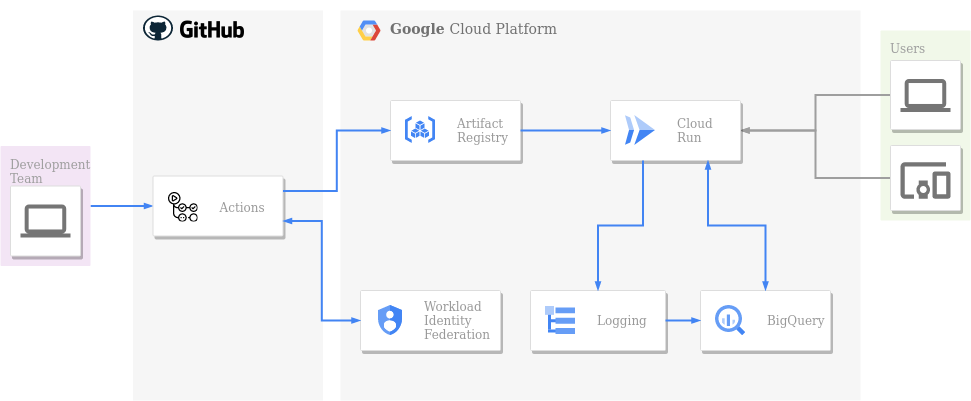

[](https://github.com/psf/black)

# Cloud Run MLOps Template
A minimal project template for machine learning development, API deployment to Google Cloud Run and monitoring.

- ML development with Jupyter Notebooks and Poetry dependency management. 
- FastAPI service development and testing (pytest) with Docker Compose.
- Deployment with [Github Actions](https://github.com/features/actions) to [Artifact Registry](https://cloud.google.com/artifact-registry) and serving with [Cloud Run](https://cloud.google.com/run).
- Model serving [logging](https://cloud.google.com/logging) into [BigQuery](https://cloud.google.com/bigquery) for monitoring.
- Github-GCP "secret free" authentication with [Workload Identity Federation](https://cloud.google.com/iam/docs/workload-identity-federation)




## Table of Contents
- [Technologies](#technologies)
- [Usage](#usage)
  - [1. Build a machine learning model](#1-build-a-machine-learning-model)
    - [Poetry package management](#poetry-package-management)
    - [ML modeling in Jupyter Notebook](#ml-modeling-in-jupyter-notebook)
  - [2. Build the API](#2-build-the-api)
    - [Endpoints](#endpoints)
    - [Testing](#testing)
  - [3. Containerize](#3-containerize)
  - [4. Deploy CI/CD pipeline](#4-deploy-cicd-pipeline)
  - [5. Clean Resources (Optional)](#5-clean-resources-optional)
- [Project structure](#project-structure)
- [References](#references)


## Technologies
The project was created with:
- [Ubuntu](https://ubuntu.com/) 22.04.1 LTS
- [Docker](https://docs.docker.com/engine/install/) 20.10.18
- [Docker Compose](https://docs.docker.com/compose/install/) 2.10.0
- [Python](https://wiki.python.org/moin/BeginnersGuide/Download) 3.10.4
- [Poetry](https://python-poetry.org/docs/#installation) 1.2.0
- [Google Cloud CLI](https://cloud.google.com/sdk/docs/install) 401.0.0


## Usage


### 1. Build a machine learning model

---

Build a predictive machine learning model with a Jupyter Notebook.

#### Poetry package management

Create a virtual environment and install all dependencies.
```
poetry install
```

Add or remove packages.
```
poetry add seaborn  # append --group dev if it is only required in development environment.
poetry remove seaborn
```


#### ML modeling in Jupyter Notebook
Open ```mlmodel/build_ml_model.ipynb``` and select created virtual environment (requires restart in VSCode).

The [sample notebook](mlmodel/build_ml_model.ipynb) builds a machine learning linear regression pipeline consisting of a common ML workflow and outputs the following files:
- ML model pipeline: ```app/data/ml_model.joblib```
- Pydantic model for the prediction endpoint of the API: ```app/data/pydantic_model.py```
- Sample url parameters string for ML mode prediction: ```app/data/sample_url_params.txt```
- Test data for API testing and inference monitoring: ```app/data/test_data.json```

NOTE: The remaining exteps only require the generated files, not the notebook.

### 2. Build the API

---

Build a FastAPI service.

#### Endpoints
Exposes 3 endpoint:
- ```/predict``` POST: returns prediction in exchange of a valid model input
- ```/monitor``` GET: returns the model health stats (univariate drift,...)
- ```/version``` GET: returns the deployed container version

#### Testing
The ```test/``` directory contains the required testing files for pytest.


### 3. Containerize

---

Build and launch the project in local environment. After any file change, the service reloads.
```
docker compose up -d
```

Run tests.
```
docker exec api pytest
```

Stop the container.
```
docker compose down
```

Rebuild the container when making changes in docker runtime, for example when making a change in dockerfile or adding new packages to poetry.
```
docker compose build --no-cache
```

### 4. Deploy CI/CD pipeline

---

Make sure you have your Github and Google Cloud accounts ready and enough permisions to create the services.

The ```gcp.sh``` script handles the provisioning of all the required services in Google Cloud Platform as well as generating the required files for Github Actions.

```
bash gcp.sh create \
    PROJECT_ID="myproject" \
    SERVICE="myservice" \
    REGION="myregion" \
    GH_REPO="myuser/myrepo"
```

- ```PROJECT_ID``` : google cloud project name
- ```SERVICE``` : google cloud service name (requires a length 6-30, no spaces, only alphanumeric lowercase)
- ```REGION``` : google cloud region
- ```GH_REPO``` : github repo as ```user/repository```

Time for deployment! Use ```main``` and ```dev``` branches as required. For example:
```
git add .
git commit -m "Initial house price prediction model"
git push origin
```

Pushes and pull requests to ```dev``` trigger build and integration test.
Pushes and pull requests to ```main``` trigger build, integration test and deployment to GCP.

#### Github Actions Workflows
- Build and test ```.github/workflows/build_test_api.yaml```:
  1. Lint with flake8
  2. Black formatting check
  3. Build the development version with docker-compose
  4. Test with pytest
- Build and deploy to Cloud Run ```.github/workflows/deploy.yaml```:
  0. Depends on previous
  1. Authentication to GCP with WIF
  2. Authentication to docker registry (Artifact Registry)
  3. Build the production container with docker
  4. Push container to Artifact Registry
  5. Create Cloud Run service declaration from template
  6. Deploy container to Cloud Run service
- Test Cloud Run service ```.github/workflows/test_service.yaml```:
  0. Depends on previous
  1. Get url parameters for live service testing
  2. Authentication to GCP with WIF
  3. Setup Google Cloud CLI
  4. Allow public access to service **(Caution!!!)**
  5. Get service URL
  6. Test ```/version``` endpoint
  7. Test ```/predict``` endpoint
  8. Test ```/monitor``` endpoint (might be some delay until logs are populated)

#### Cloud Run setup
Edit ```.github/workflows/data/cloudrun.service.template.yaml```.


### 5. Clean Resources (Optional)

---

Clean all the created Google Cloud Platform services.
```
bash gcp.sh delete \
    PROJECT_ID="myproject" \
    SERVICE="myservice" \
    REGION="myregion" \
    GH_REPO="myuser/myrepo"
```


## Project structure
```
cloud-run-mlops-template
├─ .dockerignore
├─ .github
│  └─ workflows
│     ├─ build_test_api.yaml
│     ├─ data
│     │  ├─ .env                                # generated
│     │  └─ cloudrun.service.template.yaml
│     ├─ deploy.yaml
│     └─ test_service.yaml
├─ .gitignore
├─ Dockerfile
├─ LICENSE
├─ README.md
├─ app
│  ├─ __init__.py
│  ├─ data
│  │  ├─ ml_model.joblib                        # generated
│  │  ├─ pydantic_model.py                      # generated
│  │  ├─ sample_url_params.txt                  # generated
│  │  └─ test_data.json                         # generated
│  ├─ funs.py
│  └─ main.py
├─ docker-compose.yaml
├─ gcp.sh
├─ mlmodel
│  └─ build_ml_model.ipynb
├─ poetry.lock
├─ pyproject.toml
└─ tests
   ├─ __init__.py
   └─ test_app.py

```


## References
- https://github.com/google-github-actions/example-workflows/blob/main/workflows/deploy-cloudrun/
- https://github.com/marketplace/actions/deploy-to-cloud-run
- https://github.com/google-github-actions/auth#setup
- https://cloud.google.com/logging/docs/export/configure_export_v2
- https://cloud.google.com/logging/docs/reference/libraries#client-libraries-usage-python
- https://fastapi.tiangolo.com/
- https://pydantic-docs.helpmanual.io/usage/models/

